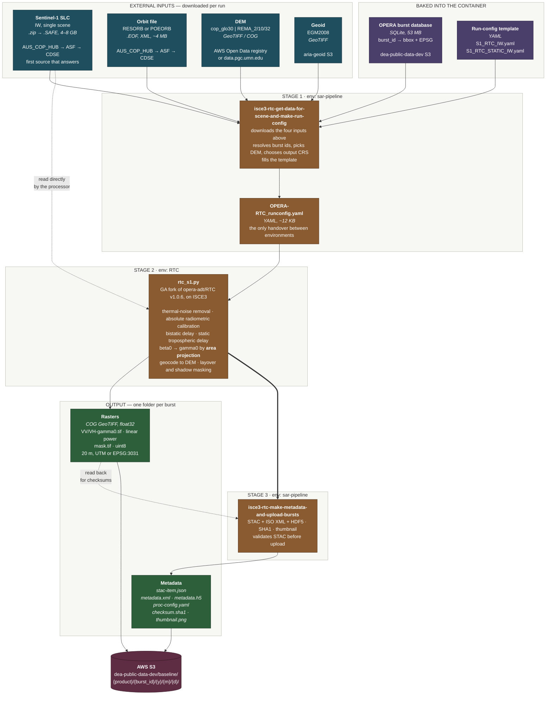

# How GA builds the Sentinel-1 NRB product

Read from `GeoscienceAustralia/sar-pipeline` at `a292888`: the entrypoint
`scripts/run_isce3_rtc_pipeline.sh`, the run-config templates in
`sar_pipeline/configs/isce3_rtc/`, and `Docker/isce3_rtc/Dockerfile`.

One run processes **one SLC** and emits **one product per burst**. Nothing is
mosaicked — `save_bursts: True`, `save_mosaics: False`.

A rendered copy of the diagram below is at
[`ga-nrb-pipeline.png`](./ga-nrb-pipeline.png), for viewers that do not draw
Mermaid.



## Inputs, by source and format

| Input | Format | Where from | Size |
| --- | --- | --- | --- |
| Sentinel-1 SLC | `.zip` → `.SAFE` | AUS_COP_HUB → ASF → CDSE, in preference order | 4–8 GB |
| Orbit | `.EOF` (XML) | same three | ~4 MB |
| DEM | GeoTIFF / COG | `registry.opendata.aws/copernicus-dem` or `data.pgc.umn.edu` (REMA) | varies |
| Geoid | GeoTIFF | `aria-geoid` S3, EGM2008 | ~1 GB |
| Burst database | SQLite | `dea-public-data-dev` S3, baked into the image | 53 MB |
| Run-config template | YAML | in-repo | 12 KB |

Credentials are needed for the SLC and orbit sources only: Earthdata for ASF,
CDSE for Copernicus, and internal credentials for the Australasian hub. The
DEM, geoid and burst database are all anonymous.

## Why three conda environments

`RTC` and `sar-pipeline` have dependency conflicts, and `pygssearch` (the
Australasian hub client) conflicts with both. The container carries all three
and the shell script switches between them. **The run config is the only thing
passed across** — stage 1 writes a YAML, stage 2 reads it, which is also why
the config ships with the product as `proc-config.yaml`.

## What the processor actually does

From `S1_RTC_IW.yaml`, in order:

1. **Thermal noise removal** — `apply_thermal_noise_correction: True`
2. **Absolute radiometric calibration** — to beta0
3. **Bistatic delay correction** and **static tropospheric delay correction**
4. **Radiometric terrain flattening** — `input_terrain_radiometry: beta0` →
   `output_type: gamma0`, `algorithm_type: area_projection`
5. **Geocoding** — `area_projection` onto the DEM grid, `biquintic` DEM
   interpolation, with layover/shadow and valid-sample sub-swath masking

`area_projection` rather than `bilinear_distribution` is the choice that makes
this CEOS-ARD: it computes the true illuminated area per pixel instead of
approximating it from the cosine of the incidence angle.

## RTC_S1 and RTC_S1_STATIC are the same run, different save flags

|  | `RTC_S1` | `RTC_S1_STATIC` |
| --- | --- | --- |
| `save_mask` | True | False |
| `save_incidence_angle` | False | True |
| `save_local_inc_angle` | False | True |
| `save_nlooks` | False | True |
| `save_rtc_anf` | False | True |

The static layers depend only on viewing geometry and terrain, so they are
produced once per burst id and referenced by every acquisition of that burst —
which is why `fetch_ga_c0.py` fetches them once per burst rather than per date.

## One SLC in, many bursts out

`cli.py:565` passes a single-element list:

```python
RTC_RUN_CONFIG.set(f"{gk}.input_file_group.safe_file_path", [str(SCENE_PATH)])
```

A burst is the atomic unit of IW acquisition — roughly 3 seconds of azimuth
data — and ESA cuts SLC slices *at burst boundaries*, so a burst is always
wholly inside one slice. GRD slices are cut at arbitrary intervals instead,
which is why a burst can span two of those: measured on `t045_095772_iw2`, one
GRD slice covered 91.6% of the burst and its neighbour the remaining 8.4%.
